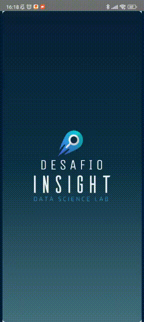

<br />
<p align="center">
  <a href="https://insightlab.ufc.br">
    
  </a>
  <h2 align="center">
    <strong>
      Desafio Insight Lab
    </strong>
  </h2>

  <p align="center">
    Esse projeto tem como objetivo implementar o desafio técnico para o processo seletivo do <a href="https://insightlab.ufc.br">Insight Lab</a> para a vaga de Desenvolvedor Full Stack Mobile.
  </p>
</p>

<p align="center"></p>

<details open="open">
  <summary>
    <strong>
      Índice
    </strong>
  </summary>
  <ol>
    <li>
      <a href="#-sobre-o-projeto">Sobre o projeto</a>
      <ul>
        <li><a href="#-pontos-principais">Pontos principais</a></li>
      </ul>
      <ul>
        <li><a href="#-framework">Framework</a></li>
      </ul>
    </li>
    <li><a href="#-instalação">Instalação</a></li>
  </ol>
</details>

# 💭 **Sobre o projeto**

O desafio consiste no desenvolvimento de um app para cadastrar os cidadãos que serão vacinados contra Covid-19.

## ❗ **Pontos principais**

- Foi disponibilizada uma [API](https://desafio-insightlab.herokuapp.com/docs/) para consumo na aplicação.
- Foi desenvolvido um [protótipo do sistema](https://www.figma.com/file/OIXMJfiB1JQimUxJCgqIXu/Seleção-Desenvolvedor-Mobile?node-id=0%3A1) que foi seguido no desenvolvimento da aplicação.

### **A interface construída possibilita as seguintes interações:**

- **Criar conta**
  - Nome do usuário
  - Email
  - Senha
- **Login do usuário**
  - Email
  - Senha
- **Cadastrar cidadão**
  - Identificação do cidadão, através da apresentação dos dados pessoais (nome, cpf, data de nascimento)
  - Nome/Tipo da vacina que será aplicada
  - Informar se é a primeira ou segunda dose da vacina
- **Listagem de todos os vacinados**
  - Filtrar o cidadão por dose tomada (lista de quem tomou apenas a primeira dose e quem tomou as duas doses)

## ✨ **Framework**

- <a href="https://reactnative.dev"></a>
- <a href="https://git-scm.com"></a>
- <a href="https://github.com"></a>
- <a href="https://styled-components.com"></a>
- <a href="https://redux.js.org"></a>
- <a href="https://www.typescriptlang.org"></a>
- <a href="https://expo.io"></a>
- <a href="https://yarnpkg.com"></a>

# 📲 **Instalação**

- Clonar o repositório com o comando
  ```sh
  git clone https://github.com/LinsThi/desafio-insightlab.git
  ```
- Para instalar todas as dependências utilizadas no projeto, basta executar o comando `yarn`.
- A aplicação pode ser iniciada com `expo start`.
- É preciso rodar a aplicação em um emulador ou no próprio celular.

---
